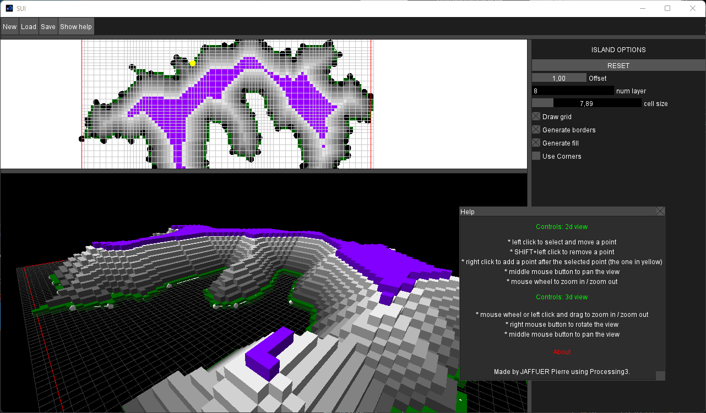

# SUI

A simple 3d Voxel island surface generator from a 2d polygon made with Processing 3.
The core of this project is a custom retained mode GUI implemented on top of Processing's drawing functions.

# Manual

- To generate the 3d island, you must have "Generate Borders" and "Generate fill" enabled, you can control the "height" of the terrain by increasing the "num layer"
- Press the "Show help" button in the application to have a summary of the view's controls
- Some premade islands can be loaded from the "examples" folder

# Screenshot

